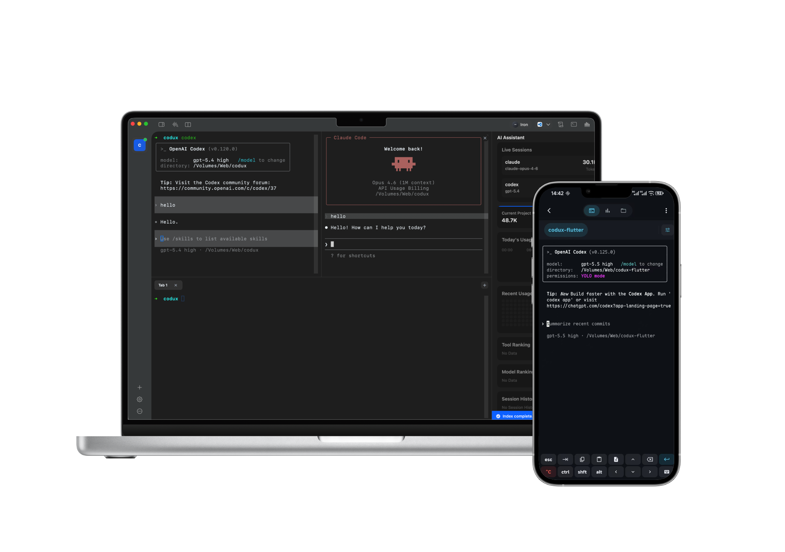

<p align="center">
  
</p>

<h1 align="center">Codux AI</h1>

<p align="center">
  <b>Rust 原生 AI CLI 工作台。</b><br/>
  把 Codex、Claude Code、Gemini CLI、OpenCode、Kiro CLI、CodeWhale、Agy 的项目、worktree、终端、Git、记忆、Token、SSH 和移动端接力统一管理起来。
</p>

<p align="center">
  <a href="https://codux.dux.cn">官网</a> &middot;
  <a href="https://github.com/duxweb/codux/releases">下载</a> &middot;
  <a href="https://github.com/duxweb/codux-flutter/releases">移动端</a> &middot;
  <a href="#作者微信">作者微信</a> &middot;
  <a href="https://github.com/duxweb/codux/issues">反馈</a>
</p>

<p align="center">
  <a href="README.md">English</a> | 简体中文
</p>

---



## 为什么用 Codux AI

AI 编程 CLI 很强，但真正干活时，项目、Git worktree、终端、历史会话、Token、远程 shell 和上下文很快就会散落一地。Codux AI 把这些长期 AI 编程工作流收进一个稳定的桌面工作台。

| AI 编程哪里容易乱 | Codux AI 提供什么 |
| :---------------- | :---------------- |
| 每个 AI CLI 都有自己的状态 | 一个按项目组织的 runtime 视图，统一管理 Codex、Claude Code、Gemini CLI、OpenCode、Kiro CLI、CodeWhale 和 Agy。 |
| 长会话难恢复 | 实时 AI runtime 状态、本地历史索引、会话恢复和按 worktree 关联的上下文。 |
| 并行任务互相干扰 | 以 worktree 为核心的任务模型，每个任务保留自己的终端布局、Git 状态、文件和 AI 会话。 |
| Token 用量不透明 | 按工具、模型、项目、worktree 和日期统计用量，不需要手动记账。 |
| 项目上下文容易丢 | 本地记忆保存用户习惯、项目画像、模块笔记，并为支持的 CLI 注入上下文。 |
| 服务器连接难复用或不安全 | 保存 SSH 配置、测试连接，并提供 AI 工具可用但不暴露凭证的 `codux-ssh`。 |
| 离开电脑就中断 | Codux Mobile 通过 v3 Relay / WebRTC 链路配对桌面端，可以远程继续控制会话。 |

Codux AI 不是要替代编辑器。它面向已经重度使用 AI 编程 CLI 的开发者，解决多项目、长会话、并行任务、上下文沉淀、Token 可视化和远程接力这些真实问题。

## Worktree 优先的工作流

Codux 的核心结构是 **项目 -> Worktree / 任务 -> 终端、文件、Git、AI 会话**。

- 为并行任务创建 Git worktree，避免多个任务混在同一个分支状态里。
- 切换任务时保留终端标签页、分屏、底部高度、当前 AI 会话、文件上下文和 Git 状态。
- 评审 worktree 变更，对比 base 分支，合并回主线，并清理完成的 worktree。
- AI 历史和运行状态跟随当前 worktree，项目级记忆保持共享。

这和普通终端复用工具不一样：Codux 知道每个终端属于哪个项目和 worktree，并围绕这个关系恢复整个工作区。

## AI 工具支持

Codux 会从托管终端中识别已支持的 CLI，读取可用的本地会话历史，并在工具支持时安装应用托管的 hook 或记忆文件。

| 工具 | Runtime 状态 | 历史索引 | 会话恢复 | 记忆注入 |
| :--- | :----------- | :------- | :------- | :------- |
| Codex | 完整 | 完整 | 完整 | 支持 |
| Claude Code | 完整 | 完整 | 完整 | 支持 |
| Gemini CLI | 完整 | 完整 | 取决于工具 | 支持 |
| OpenCode | 完整 | 完整 | 取决于工具 | 支持 |
| Kiro CLI | 完整 | 完整 | 取决于工具 | 支持 |
| CodeWhale | 完整 | 完整 | 取决于工具 | 支持 |
| Agy | 完整 | 完整 | 取决于工具 | 支持 |

`完整` 表示 Codux 可以在正常终端工作流里追踪该能力。`取决于工具` 表示 Codux 会保留工作区和历史，但具体恢复行为仍取决于对应 CLI 自身能力。

## Runtime Driver 架构

Codux 不是简单包一层 shell。每个支持的 AI 工具都有 runtime driver，用统一链路管理集成能力：

- **Hooks** 捕获开始、完成、中断、权限等待、模型和会话元数据。
- **Probes** 探测当前运行中的会话、工具、模型和累计用量。
- **History sources** 将本地 CLI transcript 统一成一条时间线。
- **Memory injection** 为支持的 CLI 注入项目上下文，避免在各 wrapper 中重复拼逻辑。

这样多个 Codex、Claude、CodeWhale 或其他工具会话不会串状态，后续接入新 AI 工具也不需要重写整条 runtime 链路。

## AI 历史、Token 和记忆

Codux 会在本地索引 AI 会话历史，并把它变成可继续使用的项目上下文。

- 按项目和 worktree 查看近期会话。
- 按日期、模型、工具、项目和工作区统计 Token 用量。
- 从会话中提取用户偏好、项目画像和模块笔记。
- 记忆提取由 runtime 排队处理，避免卡住 UI。
- 启动支持的 AI CLI 时注入相关上下文。

记忆和历史都保存在本地。Codux 把项目列表和记忆视为核心资产；AI 历史可以从支持的本地 CLI transcript 重新构建。

## Git、文件和安全连接

Codux 把 AI 工作中常用的项目界面放在终端旁边：

- 浏览文件、预览素材，并把文件路径拖进终端。
- 查看 Git 变更、暂存 diff、查看历史、pull、push，并处理 worktree 合并。
- 保存 SSH 配置，支持密码或私钥凭证。
- 保存前测试 SSH 连接。
- 从 SSH 面板连接，或让 AI CLI 使用注入的 `codux-ssh <profile>` 命令连接。

`codux-ssh` 只通过 profile id 引用已保存配置，不会把密码、私钥口令或原始连接详情暴露给 AI CLI 提示词。

数据库和其他安全连接配置在规划中。当前版本请通过已有 CLI 工具、SSH 隧道或远程 shell 工作流访问数据库。

## 移动端接力

Codux Mobile 通过 v3 远程链路连接桌面端。

- 使用短期二维码 ticket 与桌面端配对。
- Relay 设置留空使用全球公共节点，也可以选择 China 节点或配置自定义 Relay 地址。
- 可直连时优先使用 WebRTC DataChannel，P2P 不可用时回落 WebSocket 中继。
- 项目、终端、文件和 AI 会话始终运行在桌面端，移动端只负责远程控制。
- local、WebRTC、WebSocket Relay 和未来传输驱动都进入同一个 runtime 协议模型，由项目、终端、文件、Git/worktree 和 AI 统计状态统一承接。

终端输入输出、文件内容、项目列表和 AI 统计都会在 Codux Desktop 与 Codux Mobile 之间加密传输。

协议边界和 v3.1 分层说明见 [Remote Protocol Architecture](docs/remote-protocol-architecture.md)。

## 自定义宠物

Codux 内置可选桌面伙伴，会随着你的 AI 编程习惯成长。宠物可以根据用量、提醒和 AI 工作状态主动反馈，也可以从 Petdex 导入 Codex 风格自定义宠物包，格式是 `pet.json` + `spritesheet.png`。

## 快速开始

1. 从 [GitHub Releases](https://github.com/duxweb/codux/releases) 或 [codux.dux.cn](https://codux.dux.cn) 下载 Codux。
2. 安装应用：
   - macOS：打开 `.dmg`，将 Codux 拖入应用程序文件夹。
   - Windows：运行 `setup.exe` 安装包。
3. 打开一个项目目录。
4. 在集成终端里启动你的 AI CLI。
5. 可选：创建 worktree 任务、连接 SSH 配置，或配对 Codux Mobile。

推荐下载：

| 平台 | 文件 |
| :--- | :--- |
| macOS | `codux-*-macos-*.dmg` |
| Windows | `codux-*-windows-x86_64-setup.exe` |

updater 包和 `latest.json` 主要用于自动更新、测试回退或自动化流程。大多数用户下载上面两个安装包之一即可。

## 快捷键

| 操作 | 快捷键 |
| :--- | :----- |
| 新建分屏 | `⌘T` |
| 新建标签页 | `⌘D` |
| 切换 Git 面板 | `⌘G` |
| 切换 AI 面板 | `⌘Y` |
| 切换项目 | `⌘1` - `⌘9` |

所有快捷键均可在 **设置 > 快捷键** 中自定义。

## 演示视频

GitHub README 不会渲染第三方 iframe 播放器，可以前往 [Bilibili](https://www.bilibili.com/video/BV1mK9vBCEYD/) 观看演示视频。

## 作者微信

扫码添加作者微信，备注 Codux，即可邀请加入 DUXAI 交流社群。

<p align="center">
  
</p>

## 开发

```bash
cargo run
```

提交变更前建议运行：

```bash
cargo check
cargo test -p codux-runtime ssh::tests
node scripts/release/test-package-gpui.mjs
```

桌面端通过推送版本标签触发发布，例如 `v1.6.2`。发布工作流会构建 Rust 原生 macOS 和 Windows 产物，发布 GitHub Release，并更新对应的自动更新通道。

## 系统要求

- macOS 14.0 (Sonoma) 或更高版本
- Windows 11

## 反馈

发现 Bug 或有功能建议？欢迎在 [GitHub Issues](https://github.com/duxweb/codux/issues) 中提出。

提交 Bug 时，推荐使用 **帮助 -> 导出诊断包**，然后把生成的 `.zip` 附到 Issue。诊断包会包含运行日志、轮转日志、性能摘要、应用状态、无效状态备份，以及可匹配到的 macOS 诊断报告。

手动日志路径：

- `~/Library/Application Support/Codux/logs/runtime-rust.log`
- `~/Library/Application Support/Codux/logs/performance-summary.json`
- `%APPDATA%\Codux\logs\runtime-rust.log`

---

## 贡献者

感谢所有为 Codux 贡献代码、Issue、测试和反馈的朋友。

<p align="center">
  <a href="https://github.com/duxweb/codux/graphs/contributors">
    
  </a>
</p>

## GitHub Star 趋势

[](https://star-history.com/#duxweb/codux&Date)

<p align="center">
  本来想叫 dmux，可惜名字被占了，那就叫 Codux 吧，中文谐音刚好是「酷 Dux」。
</p>

<p align="center">
  <a href="https://codux.dux.cn">codux.dux.cn</a>
</p>
