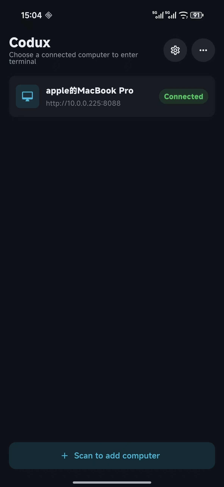
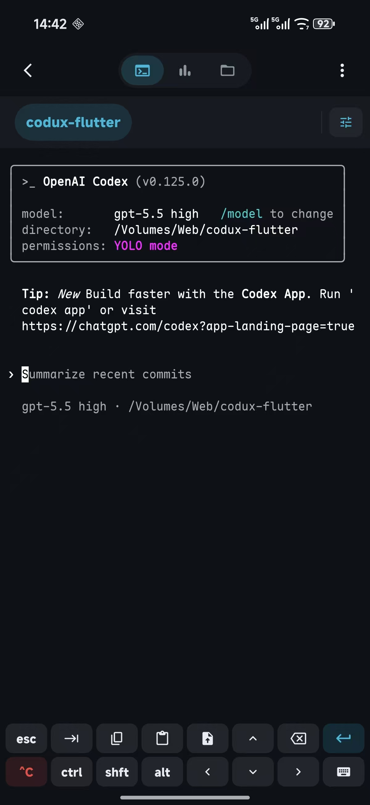

<h1 align="center">Codux Mobile</h1>

<p align="center">
  <strong>Codux 桌面工作台的原生移动端主控。</strong>
</p>

<p align="center">
  <a href="https://github.com/duxweb/codux-flutter/releases">
    
  </a>
  <a href="LICENSE">
    
  </a>
  
  
  
</p>

<p align="center">
  <a href="https://github.com/duxweb/codux">macOS 端 Codux</a> &middot;
  <a href="https://github.com/duxweb/codux-flutter/releases">下载</a> &middot;
  <a href="https://github.com/duxweb/codux-flutter/issues">反馈</a>
</p>

<p align="center">
  <a href="README.md">English</a> | 简体中文
</p>

---

## 界面预览

<p align="center">
  
  
</p>

## 为什么需要 Codux Mobile？

Codux Desktop 负责真实项目、终端会话、AI 工具运行、Git/worktree 状态、文件和配对确认。Codux Mobile 是手机侧主控端，用移动端友好的方式连接这个工作台，远程显示和操作 runtime 状态，同时避免手机输入法导致桌面端终端反复 resize。

移动端当前聚焦三件事：

- **稳定的 Android 终端渲染**：远程 PTY 字节先进入共享 Rust `codux-terminal-core` 无头屏幕模型，再由 Flutter 自绘，不再走 WebView 或平台专用终端插件。
- **移动端输入体验**：支持快捷工具栏、输入法开关、粘贴、图片上传，以及针对 TUI 程序调过的输入法避让。
- **接入 Codux 工作台**：扫码配对、设备列表、项目标签、终端分屏、文件浏览、AI 用量面板都通过 v3.1 远程协议连接 Codux 桌面 host。

## 功能

| 模块 | 状态 | 说明 |
|:--|:--|:--|
| 配对 | 可用 | 扫描 macOS 端 Codux 的二维码，提交配对申请，等待 Mac 端确认。 |
| 设备管理 | 可用 | 本地保存多台 Mac，可编辑 relay 地址和设备名称，断线后后台重连。 |
| 远程终端 | 可用 | 渲染 Rust 维护的远程 PTY 屏幕模型，并把用户输入显式发回 Mac 端。 |
| 输入法处理 | 可用 | 输入法弹出时保持终端高度稳定，只移动显示区域，避免 TUI 界面被重绘压坏。 |
| 快捷键 | 可用 | 双排工具栏包含 Esc、Tab、复制、粘贴、上传、方向键、删除、回车、Ctrl、Shift、Alt、键盘开关和 `^C`。 |
| 文件 | 可用 | 浏览项目文件、记忆每个项目目录、打开/编辑文件、重命名、复制路径、删除。 |
| AI 统计 | 可用 | 展示 macOS 端转发的当前项目和近期 AI 用量。 |
| 更新检查 | 可用 | 读取 `duxweb/codux-flutter` 最新 GitHub Release。 |

## 架构

```text
Codux Mobile (Flutter 主控端)
  ├─ UI 外壳：渲染 runtime 状态并发出用户意图
  ├─ Runtime store：选中项目、当前终端、同步状态
  ├─ 协议客户端：v3.1 envelope、capabilities、分片组包、ack/retry
  ├─ Rust 传输 FFI：Iroh QUIC 主控/被控链路
  └─ Rust terminal-core FFI：RemotePtySession + libghostty-vt 无头屏幕模型

Codux Desktop host
  ├─ 持有项目、终端会话、PTY、文件、Git/worktree 状态和 AI 用量
  └─ 确认移动端配对并提供 runtime domain 协议消息
```

移动端只作为主控端，不作为终端会话、文件、Git 状态或项目列表的源头。真实会话仍由桌面端工作台管理。业务 payload 会封装为端到端加密的 `secure.message`，终端历史使用有界 v3.1 buffer window，支持分片组包和进度显示。终端字节必须先进入 `RemotePtySession`，Flutter 只读取生成后的屏幕 cell 并负责绘制和输入意图。

## 环境要求

- Flutter stable，Dart `^3.11.5`
- Android SDK 36
- JDK 17
- Android 8.0 / API 26 或更高
- 正在运行的 Codux macOS host 和 relay 配对码

## 开发

```bash
cd <codux-repo>/apps/mobile
flutter pub get
flutter run
```

### 验证

```bash
flutter analyze
flutter test
flutter build apk --debug
flutter build apk --release
```

Debug APK：

```text
build/app/outputs/flutter-apk/app-debug.apk
```

Release APK：

```text
build/app/outputs/flutter-apk/app-release.apk
```

## 日志等级

Flutter 层应用代码和终端渲染共用构建时日志等级：

```bash
flutter run --dart-define=CODUX_LOG_LEVEL=debug
flutter build apk --release --dart-define=CODUX_LOG_LEVEL=warn
```

支持等级：

- `debug`
- `info`
- `warn`
- `error`
- `off`

默认等级是 `warn`。Release workflow 默认也使用 `warn`，必要时可在手动 workflow 中调整。

## 发布

移动端源码维护在当前 monorepo 的 `apps/mobile` 下。移动端签名和公开发布继续放在遗留的 `duxweb/codux-flutter` 仓库，这样不需要迁移已有 Android / iOS 签名 secrets：

- `CHANGELOG.md` 和 `CHANGELOG.zh-CN.md` 记录版本更新。
- `scripts/release/build-release-notes.sh` 从中英文更新日志提取 GitHub Release 内容。
- `duxweb/codux` 是桌面端、共享 crates 和移动端源码仓库。
- `duxweb/codux-flutter` 是移动端发布仓库。它的 workflows 从 monorepo 源码构建，并使用现有移动端 secrets 发布 GitHub Release / TestFlight 产物。

### Android 签名

Android 正式发布需要在 `duxweb/codux-flutter` 配置这些 secrets：

- `CODUX_ANDROID_KEYSTORE_BASE64`
- `CODUX_ANDROID_KEYSTORE_PASSWORD`
- `CODUX_ANDROID_KEY_ALIAS`
- `CODUX_ANDROID_KEY_PASSWORD`

生成 keystore 的 base64 内容：

```bash
base64 -i codux-release.jks | pbcopy
```

本地没有 `android/key.properties` 时，release 构建会回退到 debug 签名，方便本地 `flutter run --release`。GitHub 发布时如果已配置签名 secrets 会使用正式签名，否则会带 workflow warning 发布同样的 debug 签名兜底 APK。

### iOS 签名

TestFlight 发布需要在 `duxweb/codux-flutter` 配置这些 secrets：

- `IOS_DISTRIBUTION_CERT_BASE64`
- `IOS_DISTRIBUTION_CERT_PASSWORD`
- `IOS_PROVISIONING_PROFILE_BASE64`
- `APP_STORE_CONNECT_API_KEY_ID`
- `APP_STORE_CONNECT_API_ISSUER_ID`
- `APP_STORE_CONNECT_API_KEY_P8_BASE64`

### 发布版本

1. 在 `apps/mobile/CHANGELOG.md` 和 `apps/mobile/CHANGELOG.zh-CN.md` 写入目标版本更新记录。
2. 如有需要，同步更新 `pubspec.yaml` 版本号。
3. 在 `duxweb/codux` 提交发布变更，然后推送 `main` 和源码 tag：

```bash
cd <codux-repo>
git tag v0.1.1
git push origin main
git push origin v0.1.1
```

4. 在 `duxweb/codux-flutter` 推送同名 tag，触发移动端发布 workflows：

```bash
cd <codux-flutter-release-repo>
git tag v0.1.1
git push origin v0.1.1
```

`duxweb/codux-flutter` 的移动端发布 workflows 会从匹配的 `duxweb/codux` tag 构建 `apps/mobile`，把 `Codux-Mobile-<version>-arm64-v8a-android.apk` 和 `SHA256SUMS.txt` 发布到移动端 GitHub Release，并可选上传 iOS IPA 到 TestFlight。

## 目录结构

| 路径 | 说明 |
|:--|:--|
| `lib/` | Flutter 应用外壳、relay 客户端、页面、组件、主题和多语言。 |
| `plugin/codux_protocol_ffi/` | Android、iOS 和桌面共用的 Rust 协议与终端 core FFI。 |
| `android/` | Android 应用壳和发布签名配置。 |
| `.github/workflows/` | 当前 monorepo 的桌面发布和正式 macOS 签名 workflow。 |
| `scripts/release/` | 更新日志提取脚本。 |
| `docs/images/` | 截图预留目录。 |

## 开源协议

Codux Mobile 使用 GNU General Public License v3.0，和 macOS 端 Codux 保持一致。详情见 `LICENSE`。

## 相关项目

- [Codux for macOS](https://github.com/duxweb/codux)
- [Codux Mobile Releases](https://github.com/duxweb/codux-flutter/releases)
